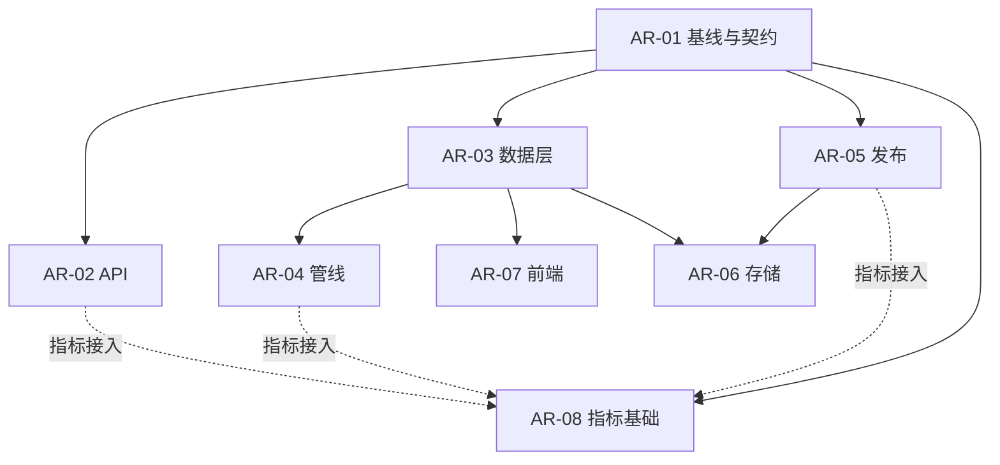

# MaaS Daily 架构改造任务清单

日期：2026-10-02（Asia/Shanghai）。状态：**已上线，AR-01 DONE；AR-02/03/04/05/07/08 RELEASED；AR-06本地演练完成，远端DEFERRED**。

本文是本轮架构改造的入口。目标是在保留稳定 ID、证据追溯和版本一致性的基础上，降低数据增长、增加信源和增加页面的成本。分为 8 个可独立交付的任务；每个任务都包含实施步骤、验收和回退要求。

## 1. 先做什么

第一批完成 AR-01、AR-02、AR-05：建立可复核基线，消除 API 重复全量加载与访客共享限流问题，协调数据写入和发布。

第二批完成 AR-03、AR-04、AR-07：统一数据输入与契约，拆分信源适配器，逐步迁移页面组件。

AR-08 在 AR-01 后即可开始，随各任务补充指标；AR-06 先完成存储清单与迁移演练，再切换存储。不要等全部任务结束才收集性能数据。

| ID | 任务与文档 | 优先级 | 依赖 | 完成后的直接收益 |
| --- | --- | --- | --- | --- |
| AR-01 | [现状基线与契约核对](./AR-01-baseline-and-contracts.md) | P1，最先 | 无 | 统一当前事实、测量方法和兼容边界 |
| AR-02 | [API 加载、查询与限流](./AR-02-api-runtime.md) | P1 | AR-01 | 避免无变化重复加载，降低查询成本，隔离客户端额度 |
| AR-03 | [标准数据层与共享契约](./AR-03-data-contracts.md) | P1 | AR-01 | 管线和公开导出不再依赖站点目录 |
| AR-04 | [信源适配器与可恢复管线](./AR-04-pipeline.md) | P2 | AR-03 | 新信源接入更集中，失败可单独重跑 |
| AR-05 | [工作流与发布构建](./AR-05-release-workflows.md) | P1 | AR-01 | 减少写入冲突、重复构建和无效发布 |
| AR-06 | [存储分层与历史迁移](./AR-06-storage.md) | P2 | AR-03、AR-05；容量预算参考 AR-08 | 降低 Git、历史归档与发布传输成本 |
| AR-07 | [页面数据模型与组件](./AR-07-frontend.md) | P2 | AR-03；构建接口沿用 AR-05 | 增加页面和语言时复用业务逻辑 |
| AR-08 | [运行指标与容量决策](./AR-08-observability.md) | P1 基础，P2 完善 | AR-01；随 AR-02/04/05 接入 | 用实际指标判断告警、扩容和数据库迁移 |

P1/P2 表示本轮实施先后，不代表已经发生生产事故。具体工期应在 AR-01 确认测试、构建和发布耗时后估算。



如果由一个人顺序执行，建议：AR-01 → AR-02 → AR-05 → AR-08 基础 → AR-03 → AR-04 → AR-07 → AR-06 → AR-08 容量复核。存在独立负责人时可按依赖并行，但共享 Schema、导出器、构建脚本的改动必须串行合入。

## 2. 本次分析的已知事实

以下来自 2026-10-01 的本地仓库检查，执行 AR-01 时需重新采集。目录占用是本地磁盘占用，不等于 Git 历史大小或生产内存。

| 项目 | 观察值 |
| --- | --- |
| `data/` | 约 975 MB |
| `data/public/v1/` | 约 352 MB |
| `data/snapshots/` | 约 242 MB |
| Git 跟踪的 `data/` 文件 | 97,946 个 |
| 当前数据版本 | `ds_6fd3cc403bf9314b2c61286faaf46e98ff27568a47b943af88c75692724a689f` |
| `dataThrough` | `2026-10-01` |
| 当前版本七个集合文件 | 约 51 MB（实际字节约 5,143 万） |
| changes / prices / evidence | 7,459 / 1,435 / 11,651 条 |
| API 加载 | 默认 30 秒轮询，每次同步完整加载；未先比较版本 |
| API 限流 | REST、MCP 各一个进程级共享桶；Nginx 另有按 IP 限流 |
| 发布 | 不可变 release、服务器锁、旧提交拒绝、蓝绿切换和四入口验证已存在 |
| 分析统计 | 后续验收记录为 Umami Cloud；早期自托管方案不是当前服务清单 |

未在本次任务规划中执行线上压测、服务器配置变更或全量回归；不能用以上文件规模推断线上延迟和 RSS。

## 3. 所有任务共同遵守的兼容边界

1. 保留 record ID、revision、permalink、factKey、证据引用与撤回条目的可访问性。不通过重新生成 ID 解决迁移问题。
2. 金额保留 Decimal 字符串及原币种、单位、region、billingMode、serviceTier、contextBand、timeCondition；不同条件不能直接合并为最低价。
3. 同一数据版本保持确定性；`generatedAt` 等非业务墙钟不得制造业务版本变化。迁移期以同输入生成的新旧集合字节或规范内容比对证明兼容，偏差必须逐项解释。
4. cursor 固定 datasetVersion、查询参数与排序键；保留 HMAC 验证。缓存淘汰不等于版本过期，仍可用的历史版本必须能够重新加载。
5. 公开版本保留当前规则：当前版本、7 自然日内记录版本、至少上一版。迁移实现不能悄悄缩短保留期。
6. 网站、API、RSS、Skill 保持 release 一致性；候选槽位只读自己的 release。继续使用 manifest 验证、蓝绿激活和现有回滚协议。
7. 不把失败沿用的旧数据标 fresh；摘要、文章图片或统计服务失败不能破坏核心事实。
8. `providerId` 保持历史公开查询命名空间语义，不能改称 Developer 或 Platform。复用现有 T07 注册表与决策，不重复创建另一套身份体系。

主要参考：[公开 API 契约](../../contracts/public-api-v1.md)、[MCP 契约](../../contracts/mcp-v1.md)、[RSS 契约](../../contracts/rss-v1.md)、[发布操作说明](../../../ops/README.md)。这些文件含历史状态，冲突处理按 AR-01 完成，不能按单份旧文档盲目覆盖现状。

## 4. 每个任务的完成与发布

状态统一使用：`TODO → IN_PROGRESS → LOCAL_VERIFIED → RELEASED`。不涉及运行时发布的任务用 `DONE`；存储评估允许以有证据的 `DEFERRED` 收尾。AR-01 为 DONE，AR-02/03/04/05/07/08 已上线验收；AR-06 本地迁移演练已验收、远端 DEFERRED。八项结果与操作入口见 [交付索引](./delivery-index.md)。每项最新状态以对应任务书和结果文档为准。

每个任务新增 `AR-XX-result.md`，至少记录：

```text
状态与完成日期：
输入 commit / datasetVersion / 环境：
完成的子任务及未完成项：
变更文件与行为影响：
新旧数据与契约对比：
执行命令、退出码和必要证据路径：
性能前后结果（如适用）：
迁移、启用及回退方式：
发布 commit / RID / 四入口验证（未发布写未发布）：
后续依赖与已知限制：
```

先跑任务相关验证，正式 release 使用现有 `scripts/build-release.sh` 及其全量门禁。不要用 `--skip-tests` 的产物作为生产候选。结果文档区分本地完成与线上完成，任何等待中的决策都不能写成已完成。

本清单保留实施任务书，已完成改造的证据以结果文档和交付索引为准。生产已按用户授权上线；具体版本、四入口、配置、资源和回退见[线上验收](./release-2026-10-02.md)。

## 5. 可直接交给执行者的指令

> 请执行 `docs/architecture/refactoring-2026-10/AR-XX-任务文件.md`。先读本目录 README 和该任务的依赖结果，核对当前工作区及项目规则。按子任务顺序实现，完成相关测试并记录结果；涉及契约、迁移和发布时遵守共同兼容边界。最终提交 `AR-XX-result.md`，明确本地验证、线上发布与未完成项，不把后续任务一并扩大实施。

## 6. 后续扩展的启动条件

| 扩展 | 什么时候启动 | 启动后必须先回答 |
| --- | --- | --- |
| 查询数据库（SQLite/PostgreSQL） | AR-02 索引优化后仍无法满足 AR-01 冻结的延迟/内存预算，或开始建设用户、订阅、多写入方功能 | 数据版本如何固定、索引如何构建、迁移如何对账、备份如何恢复 |
| 跨平台 Upstream Model / Availability | 明确要提供跨平台同模型比较，且现有 T07 inventory、Gold Set 与证据足以支持映射 | 哪些是已核实关系，哪些 unresolved；如何保留 modelId 与 providerId 兼容 |
| 独立 worker / 队列 | 单次任务无法在采集周期内完成，或者需要多个独立调度者与持久重试 | 幂等、单一写入、租约、补偿、失败隔离由谁负责 |
| 多实例 API | 单实例实际容量不足，或明确有可用性目标 | 相同数据版本、共享 CURSOR_SECRET、限流口径、实例就绪与切换如何保证 |

本轮不预先引入消息队列、Kubernetes 或独立分析数据仓库。新增基础设施必须有对应的测量结果或产品需求。
