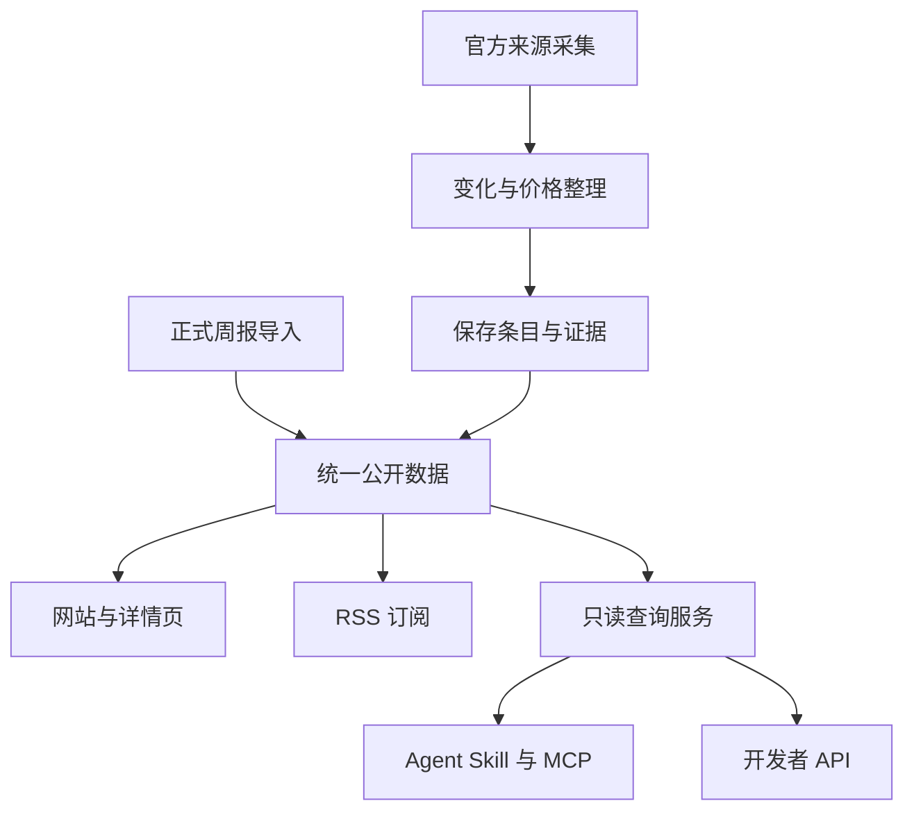

# MaaS Daily 产品规划方案

版本：0.0.1｜状态：待评审｜日期：2026-09-11

适用范围：现有 MaaS Daily 站点的下一阶段建设。本文定义要解决的问题、功能范围、使用方式、实现方法和验收标准，不代表功能已上线。

## 一、产品概述

**MaaS Daily 是面向模型 API 选型与采购的变化追踪产品：持续跟踪平台动态和价格，帮助用户发现变化、核对依据，并在自己使用的 AI 工具中直接查询。**

当前产品已有每日变化、价格台账、模型榜单和正式周报。下一阶段保留这些内容，重点补齐三种能力：

1. **能查询**：不必打开多个页面，直接问某个平台、某个模型发生了什么。
2. **能核对**：每条变化都有独立链接，能查看来源、时间和当时证据。
3. **能持续使用**：可以订阅更新，也可以接入 Codex、Claude Code 等 Agent 工具。

首版完成后的典型体验：用户在 Agent 中询问“最近一周有哪些 API 调价”，得到具体变化；追问“这个价格适用于什么条件”，得到计费说明；点击证据链接，能看到当时记录。

## 二、当前问题与建设必要性

以下现状来自现有产品和代码。用户影响是据此提出的产品判断，尚未通过正式用户访谈量化。

| 当前问题 | 对用户的影响 | 需要补齐的能力 |
| --- | --- | --- |
| 主要通过网页看每日变化和周报，尚无正式 Agent 接入与订阅入口 | 用户需要反复访问站点、复制内容，难以接入日常工作 | Agent 查询、RSS 订阅和公开数据接口 |
| 变化条目缺少独立且长期有效的地址，归档受滚动数据范围影响 | 无法稳定引用到报告、团队讨论或自动化流程 | 变化详情页、永久链接和持久归档 |
| 页面文字变化与实际业务变化尚未充分区分 | 导航调整可能被理解为产品更新，删除文本可能被误认为下线 | 清晰的变化分类、证据标识和保守表达规则 |
| 价格虽然已有结构化处理，但证据定位没有完整保存到可公开查询的数据中 | 用户看到价格后，仍难以核对当时页面及具体计费条件 | 价格事实与证据回查 |
| 数据时间、失败沿用、手工维护等信息不够直观 | 用户难以判断数据是否新鲜，哪些结论需要再核实 | 更新时间、来源状态和方法说明 |
| 内容主要按平台组织，同一模型的信息分散 | 跨平台选型仍需人工汇总 | 后续建立模型关联、跨平台时间线和对照 |
| 摘要主要解释“发生了什么” | 用户仍需自行判断是否影响成本、迁移或选型 | 后续增加适用人群和影响说明 |

现在建设的原因：内容采集和历史积累已经存在，新增查询与分发能力可以直接提高这些内容的使用价值。首版优先打通从获取信息到核对依据的流程，避免先增加更多内容栏目。

## 三、目标用户与核心场景

### 3.1 用户分层

| 用户 | 核心任务 | 最关心的信息 | 优先级 |
| --- | --- | --- | --- |
| AI 应用开发者、技术负责人 | 选择模型与接入平台，跟踪价格和服务变化 | 可用性、计费条件、更新和迁移依据 | 首要用户 |
| 产品经理、采购与行业研究人员 | 做选型评估、成本比较和内部汇报 | 可引用的变化记录、价格依据、周报 | 首要用户 |
| 自动化工具维护者 | 把变化接入 Agent、阅读器或内部应用 | 稳定接口、清晰字段、失败处理 | 首版接入用户 |

这些角色是本轮规划假设。上线前邀请少量真实使用者试用，验证他们是否能完成下列任务。

### 3.2 用户任务

| 场景 | 用户的问题 | 产品应交付的结果 |
| --- | --- | --- |
| 每周了解变化 | “最近一周哪些平台发生了变化？” | 带时间、分类和来源链接的变化清单 |
| 查询价格 | “模型 X 的输入、输出价格是多少？” | 原币种价格、单位、适用条件、观察时间 |
| 核对事实 | “这条调价的依据是什么？” | 前后值、证据摘录、来源和修订说明 |
| 获取周报 | “给我最新一期 MaaS 周报。” | 最新正式周报及完整阅读链接 |
| 持续跟踪 | “我希望不用每天打开网站。” | RSS 地址或可配置的 Agent 查询入口 |

“某模型是否已在所有平台上线”“哪个模型综合最好”不属于首版承诺，需要后续补齐模型关联和可比性规则。

## 四、产品目标与首版范围

### 4.1 目标

- 用户可以从网站、Agent 和阅读器三个入口使用同一份数据。
- 用户能沿着答案找到独立条目、官方来源和已有证据。
- 数据过期、证据不完整或来源失败时，系统明确说明，不用正常结果掩盖异常。
- 维护者可以继续使用现有采集方式，不需要为每种入口单独维护内容。

首版不设商业收入目标。先验证接入是否顺畅、查询是否有用，再决定是否需要更复杂的商业化能力。

### 4.2 版本划分

P0 是首版上线必需；P1 是首版后优先增强；P2 是中期能力，按实际需求安排。

| 优先级 | 功能 | 解决的问题 | 用户可见结果 |
| --- | --- | --- | --- |
| P0 | Agent 接入中心 | 不知道如何把站点接进工作工具 | 一页完成选择方式、复制配置和验证 |
| P0 | 自然语言与接口查询 | 找信息需要逐页查看 | 在 Agent 或应用中查询变化、价格、证据和周报 |
| P0 | 变化详情与永久链接 | 信息不能稳定分享和引用 | 每条变化有独立页面，历史可访问 |
| P0 | 价格与证据回查 | 价格条件和出处难以核实 | 查价格同时获得条件、时间、证据 |
| P0 | RSS 订阅 | 用户必须主动回访 | 订阅变化摘要或正式周报 |
| P0 | 数据状态与方法说明 | 不清楚数据新鲜度和可信边界 | 看得见更新时间、失败状态和处理规则 |
| P1 | 决策影响说明 | 知道变化但不知道是否与自己有关 | 解释受影响用户和适用条件 |
| P1 | 模型名称关联与筛选 | 同一模型的信息分散 | 按模型、平台和变化类型查找 |
| P1 | 来源健康趋势与纠错 | 难以持续发现质量问题 | 历史状态、反馈入口和修订追踪 |
| P2 | 跨平台事件时间线 | 缺少同一模型的完整进展 | 汇总发布、上架、调价和迁移记录 |
| P2 | 主题页与选型对照 | 围绕长期主题的整理不足 | 模型家族专题、多榜及价格条件并列 |
| P2 | 全量与增量同步 | 内部应用需要长期维护副本 | 首次导入后持续接收新增、更正与撤回 |

## 五、信息架构与用户流程

### 5.1 页面组织

保留现有首页、每日归档、价格台账、榜单、周报和信源页，增加以下页面及入口：

| 页面 | 页面作用 | 进入方式 |
| --- | --- | --- |
| Agent 接入 `/agent` | 展示四种接入方式及使用示例 | 顶部导航或页脚 |
| 变化详情 `/item/{id}` | 阅读一条变化，查看证据和修订 | 首页、每日归档、Agent 答案、RSS |
| 证据详情 `/evidence/{id}` | 核对当时来源摘录和计费条件 | 变化详情、价格台账、Agent 答案 |
| 数据方法 `/method` | 解释采集、差异识别、摘要和降级规则 | 数据状态提示、页脚、接入页 |
| 产品更新 `/changelog` | 说明功能和接口变化 | 接入页、页脚 |

首版不重做首页布局。只增加独立条目入口、数据时间和方法说明链接，保持现有阅读习惯。

### 5.2 主要使用流程

RSS 用户直接复制订阅地址，在阅读器查看更新；需要核对时进入同一变化详情页。维护者完成一次数据更新后，网页和各接入入口使用同一发布版本。

## 六、P0 功能需求

### F01：Agent 接入中心

**解决问题：** 用户不知道接入方式之间有什么区别，也无法判断是否已经接入成功。

**功能方案：** 页面先展示“接上后可以问什么”，再按使用场景选择入口。所有入口均无需注册账号或申请 API Key。

| 接入方式 | 面向用户 | 页面提供什么 | 完成后的使用方式 |
| --- | --- | --- | --- |
| Skill：给 Agent 的使用说明包 | 希望直接用中文提问的人 | 安装提示词、支持范围、验证问题、更新说明 | Agent 根据问题查询本站数据 |
| MCP：标准工具连接 | 已使用支持远程工具的客户端的人 | 服务地址、已验证客户端的配置、工具列表 | Agent 直接调用本站查询工具 |
| RSS：内容订阅 | 使用阅读器或自动化订阅工具的人 | 变化摘要、周报两个订阅地址 | 在自己的工具中接收内容 |
| API：程序查询入口 | 开发者 | 查询示例、字段说明、错误说明 | 在应用中调用数据 |

页面包含“复制配置”“复制验证问题”“查看详细说明”三个操作。复制成功显示反馈；失败时允许手动选择文本。客户端选项只列实际验证通过的类型，不宣称所有 Agent 都兼容。

安装成功后，提示可能需要开启新会话；以完成一次真实查询作为成功标准，不以“文件下载成功”代替。

**实现方法：** 新增接入页、静态安装包和机器可读说明文件；安装包指导 Agent 调用现有公开查询能力，不在用户电脑另建采集系统。安装位置显式选择，更新前校验下载完整性，失败保留原版本。

**验收：** 一名首次使用者能照页面完成接入并获得真实结果；正式支持至少两种经过验证的 Agent 客户端；所有复制内容均可用。接入失败不要求用户发送密钥或本地文件。

### F02：变化、价格、证据与周报查询

**解决问题：** 用户无法直接获取与某个平台或模型有关的信息，需要人工汇总。

**功能方案：** 提供五类查询，Agent 入口与开发接口使用相同数据。

| 查询能力 | 用户输入 | 结果内容 |
| --- | --- | --- |
| 查询变化 | 平台、关键词、时间范围、变化类型 | 摘要、观察日期、类型、状态、详情链接 |
| 查询价格 | 模型、平台，可指定计费组件或区域 | 各适用条件下的价格、来源时间和证据 |
| 查询条目 | 已返回的条目 ID | 完整记录、前后变化、修订说明 |
| 查询证据 | 已返回的证据 ID | 当时摘录、定位、来源和完整性说明 |
| 查询周报 | 最新或指定期次 | 正式周报内容及阅读链接 |

变化查询的默认范围为已发布数据最近 7 天，回答必须显示实际起止范围和数据截至时间；用户明确问“过去 7 天”时按用户当前时间查询并披露覆盖缺口，不能把更早一周冒充当前一周。默认展示 10 条，更多结果可继续查看。平台名称只接受已收录平台；关键词无法匹配时返回无结果及可调整的条件，不自动换成其他平台。

价格同名存在多个平台或计费条件时，返回候选项并标明差异；不能擅自选最低价。周报查询只读取正式发布的周报，“过去一周变化”与“最新周报”在产品上是两个不同结果。

**异常处理：**

| 情况 | 系统行为 |
| --- | --- |
| 范围内没有记录 | 显示“该范围内未记录到变化”，同时提供覆盖日期；不宣称没有发生变化 |
| 来源更新失败 | 可返回上次成功数据，但明确“沿用历史数据”及时间 |
| 查询条件不合法 | 指出具体条件及可接受范围，不静默扩大查询 |
| 暂时没有可用数据 | 返回服务暂不可用，不用旧知识生成实时答案 |
| 继续翻页时原数据版本已无法读取 | 提示重新查询，不静默混入其他版本 |

**实现方法：** 在现有静态站旁新增一个轻量只读服务，负责条件筛选和返回结果；API 与 MCP 共用查询逻辑。内容仍由定时管线准备，请求时不抓官网、不运行摘要模型。

**验收：** 五类查询均有真实数据或明确空结果；同一条件下网页、API 和 MCP 的事实一致；筛选与分页正确；失败结果有恢复指引。

### F03：变化详情、分享与历史归档

**解决问题：** 变化无法长期引用，用户也难以从摘要追到原始观察。

**页面内容：**

| 区域 | 展示内容 |
| --- | --- |
| 变化概述 | 标题、平台、类型、观察时间、数据状态 |
| 变化内容 | 结构化前后值或来源文本增删；摘要注明生成方式 |
| 证据入口 | 官方来源、当时证据、完整性标识 |
| 修订记录 | 更正时间、原因、撤回说明 |
| 分享操作 | 复制当前条目的永久链接 |

首版按“某来源在某一天的观察”组织通用变化；结构化价格按“某计费项在某一天的变化”组织。一个来源可能同时涉及多件事，页面应称“来源更新”，不强行包装成单一模型发布事件。

**业务规则：**

- 条目第一次公开后地址固定；改写摘要或修正事实不换地址。
- 同日重跑不会反复生成重复条目；内容修正保留原因。
- 已公开记录不因每日列表只展示近期内容而消失。
- 被确认错误的记录显示“已更正”或“已撤回”；旧链接仍解释发生了什么。
- 原始记录不足时显示“证据不完整”，不补造时间、旧价格或删除内容。

**实现方法：** 将公开条目独立保存，不再只依赖滚动列表；分配稳定 ID，保存必要的修订版本，再生成详情页。历史数据能够恢复的部分回填，无法恢复的部分保留明确限制。

**验收：** 模拟超过现有归档窗口后，旧链接仍可打开；同一条记录修改摘要不产生新链接；撤回记录仍可解释；复制链接可被外部访问。

### F04：价格条件与证据回查

**解决问题：** 用户容易把不同区域、计费档位或输入输出价格当作同一价格比较；看到价格后也难以核实。

**功能方案：** 从现有价格台账和 Agent 价格答案进入证据详情，展示以下信息。

| 信息 | 展示规则 |
| --- | --- |
| 模型与平台 | 明确具体提供方，不仅展示模型简称 |
| 计费组件 | 输入、输出、缓存读取等分别展示 |
| 金额与单位 | 使用原币种，明确每百万 tokens 等单位 |
| 适用条件 | 区域、实时／批处理、服务档位、上下文阶梯、峰谷时段；无条件项不强行展示 |
| 时间 | 观察时间必有或明确未知；官方生效时间只有来源提供时才显示 |
| 证据 | 当时页面摘录、官方地址、定位信息；完整性不足时说明 |
| 状态 | 最新有效观察、沿用旧数据或证据不完整 |

**比较规则：** 只有币种、单位和适用条件一致时，才计算涨跌比例。旧金额为零、旧值未知或条件改变时，不计算百分比。

示例仅用于说明：某计费项在相同条件下由 10 元降到 8 元，降幅为 `(10−8)/10=20%`；若只有输入项下降，表述为“输入价格下降 20%”，不能说“整体成本下降 20%”。首版不提供新的总体成本估算工具。

**实现方法：** 复用现有价格提取与校验，补存当时页面的定位和摘录；事实与证据通过 ID 关联。抓取失败保留上次事实及原证据，不把时间更新成今天。历史证据不能恢复的记录明确标识，不伪称已完整验证。

**验收：** 新发布且标为“结构化已校验”的价格均有可打开的证据；输入输出、区域和阶梯不会混算；价格变化与页面文字变化明确区分。

### F05：RSS 内容订阅

**解决问题：** 用户需要持续了解动态，却必须主动访问网站。

首版提供两个独立订阅源：

| 订阅源 | 内容范围 | 展示方式 |
| --- | --- | --- |
| 变化摘要 | 最近 100 条有效变化，不含已识别常规噪声和已撤回内容 | 标题、摘要、日期、平台、详情链接和原文入口 |
| 正式周报 | 最近 30 期正式周报 | 标题、导读、日期和完整周报链接 |

用户在接入页复制地址，粘贴到阅读器。阅读器按自身机制检查更新，产品不承诺主动推送或实时到达。建议每 30 分钟或更慢检查一次。

修订同一记录不生成新的订阅身份；阅读器是否更新已有内容取决于其实现。需要最新更正状态时，以详情页为准。首版不在 RSS 分发第三方全文。

**实现方法：** 从统一公开数据生成 RSS 文件，记录未变化时支持“无需重新下载”的条件请求；条目链接复用永久页。

**验收：** 阅读器可订阅；同条记录修改后不会以新 ID 重复出现；所有内容链接有效；周报与变化分开订阅。

### F06：数据状态、方法说明与产品更新

**解决问题：** 用户不知道哪些数据最新、哪些沿用历史，以及产品如何得出结论。

在首页变化区域、价格台账和 Agent 答案显示各自的数据时间。不要用“网站刚构建完成”的时间代替“数据刚更新”的时间。

| 状态 | 用户看到的含义 |
| --- | --- |
| 本轮成功更新 | 最近一次采集／解析成功；同时显示时间 |
| 部分来源待更新 | 部分来源失败，仍有可用数据；可查看具体来源 |
| 沿用历史数据 | 当前结果来自过去的成功记录；明确旧时间 |
| 时间或证据未知 | 现有记录无法提供相应信息，不代表最新或完整 |

方法页说明：采集范围、文本差异的局限、摘要生成方式、价格条件、手工榜单与汇率、失败沿用、更正方式。产品更新页记录新增功能、接口变化和已知限制。

首版显示当前状态和已知最后成功时间；长期成功率图表需要持续积累记录后再做，不能用零散快照倒推出精确趋势。

**实现方法：** 保存逐来源运行结果，汇总为公开状态；页面和查询结果共用状态数据。给维护者保留条目 ID、错误编号等定位信息，反馈渠道使用实际可维护的入口。

**验收：** 模拟一个来源失败时准确提示；全部失败时不展示“已正常更新”；手工数据明确日期和维护方式；方法说明与实际行为一致。

## 七、核心业务规则

| 编号 | 规则 |
| --- | --- |
| BR-01 | 来源页面有变化，不等于模型发布、下线或调价；证据不足时只描述观察到的变化 |
| BR-02 | 观察时间、官方发布时间和本站修订时间分别保存，不能互相替代 |
| BR-03 | 已公开条目保持固定地址，修订和撤回可追溯 |
| BR-04 | 价格比较必须保留币种、单位与适用条件；缺少条件时不输出确定比较结论 |
| BR-05 | AI 摘要属于解释层，不能改变事实、时间或证据等级 |
| BR-06 | 无结果只代表覆盖范围内无记录，不代表外部事件没有发生 |
| BR-07 | 网页、RSS、API 和 MCP 使用同一发布数据，不能分别维护互相冲突的事实 |
| BR-08 | 数据更新失败可沿用历史结果，但必须明确时间与失败状态 |
| BR-09 | 默认匿名只读，无用户数据上传；接口不提供任意网站抓取或系统执行能力 |

## 八、整体实现方式

实施原则是“内容处理一次，多个入口共同使用”。现有定时采集、价格提取和周报导入继续使用；补齐数据保存与校验，再生成公开数据。

网站保持静态页面，新建的只读查询服务负责按平台、模型、时间等条件查找。站点与接口一起发布同一份数据，失败时保留有效版本。底层文件、接口字段和部署命令在工程任务中细化，不要求产品使用者理解。

首版无需重建完整采集系统，也无需引入账户、复杂数据库或全文搜索平台；实际数据规模超出简单查询能力后再评估扩展。

## 九、版本计划与交付安排

| 阶段 | 目标 | 主要交付 | 完成标准 |
| --- | --- | --- | --- |
| P0-1：信息可核对 | 建立长期引用与证据基础 | 条目归档、价格证据、详情页、数据状态 | 历史链接有效，证据可查，异常不误导 |
| P0-2：信息可查询 | 让 Agent 和应用直接使用 | 查询服务、MCP、Skill、接入说明 | 真实客户端完成五类查询 |
| P0-3：信息可订阅并上线 | 完成分发和运行保障 | RSS、接入页、方法页、发布与回滚 | 全流程验收通过，四种入口均可用 |
| P1：解释与查找增强 | 降低理解与筛选成本 | 影响说明、模型名称关联、筛选、健康趋势 | 用户更容易找到相关变化并判断影响 |
| P2：跨平台决策支持 | 将分散信息组织成完整进展 | 事件时间线、主题、条件对照、按需增量同步 | 用户可围绕同一模型完成跨平台追踪 |

P0 初步估算约 7–10 个有效开发日，并预留集成验证时间，整体按两周左右工作量安排。这是基于当前范围的工程估算，不是已承诺发布日期；历史证据恢复和客户端兼容性需在实施初期确认。

P0-1 与 P0-2 是中间交付，不能替代首版整体完成。若需要压缩排期，优先减少历史证据回填规模并明确标识，不删除新数据的证据要求，不以未接通的按钮代替真实入口。

## 十、成功指标与验收方法

### 10.1 上线验收门槛

| 指标 | 目标 | 检查方式 |
| --- | --- | --- |
| 核心查询可用 | 五类查询全部通过 | 用真实发布数据逐项调用 |
| 新结构化价格证据完整 | 100% 有可访问证据 | 自动校验全部引用，抽样人工核对条件 |
| 公开链接有效 | 构建内链接零悬空 | 自动检查，并模拟超过归档窗口 |
| 重跑与修订稳定 | 不产生重复 ID 或订阅项 | 重复执行、更正、失败恢复测试 |
| 异常提示准确 | 覆盖部分失败、全部失败、空结果 | 故障模拟与页面／Agent 输出检查 |
| Agent 接入兼容 | 至少两种客户端实测通过 | 安装／配置后真实调用 |

### 10.2 产品效果验证

核心产品指标为**目标任务完成率**：用户能否从接入开始，找到所需信息并打开证据。

- 当前没有统一的接入流程，也没有可比较的完成率基线；不填造现状数字。
- 首发邀请 5 名目标用户，各执行“接入并查变化”“查价格并核验证据”两项任务。
- 初始目标为 10 次任务中至少 8 次无需维护者代操作完成；记录失败原因与耗时，不用小样本外推所有用户。
- 首次接入的体验目标为 10 分钟内完成，包含阅读说明与客户端配置；作为试用目标，不作为外部服务承诺。
- 运行两周后复访这些用户，了解是否继续使用，以及哪些问题无法回答，再安排 P1 顺序。

运行侧记录接口成功率、响应时间、内容更新时间和订阅请求情况。匿名请求量只能代表调用量，不等同用户数或留存率；首版无需引入跨渠道身份追踪。

## 十一、非功能要求

| 方面 | 要求与验收口径 |
| --- | --- |
| 性能 | 在部署机预热、10 个并发客户端、连续 5 分钟的本地压测下，常用查询服务端 p95 目标 ≤1 秒；不含用户网络和 Agent 模型生成耗时 |
| 可用性 | 数据更新失败不破坏上次有效服务；查询服务不可用时，已发布网页和 RSS 仍可访问 |
| 一致性 | 一次查询和连续分页不能混用不同数据版本；无法继续时明确要求重新查询 |
| 兼容性 | 接入页覆盖桌面和移动端；配置仅承诺实际验证的客户端；RSS 使用标准阅读器验证 |
| 安全边界 | 公开只读服务不加载采集凭据、不执行来源 HTML、不执行文章中的指令，不开放任意文件或 URL 访问 |
| 可维护性 | 一套内容和查询规则服务全部入口，提供错误定位及明确更新流程 |
| 可恢复性 | 发布前检查完整性；模拟发布失败及回滚；回滚后已公开的永久链接仍可解释 |

## 十二、首版不做的内容

- 泛 AI 资讯聚合、新增社交媒体采集和每日固定数量精选。
- 账户、收费、跨设备收藏、个性化关注和主动消息推送。
- 综合能力打分、跨榜加权排名、自动推荐“最优模型”。
- 第三方全文镜像和全文 RSS。
- 全量历史自动补证、任意历史范围完整搜索和秒级实时数据。
- 自动多信源事件合并、长期增量同步协议。

这些内容不是永久排除，只是不作为本轮首发条件。

## 十三、依赖、风险与待确认事项

| 依赖或风险 | 对产品的影响 | 处理方式 |
| --- | --- | --- |
| 历史证据可能不足 | 部分旧记录无法完整核实 | 回填可恢复部分，其余标明不完整；至少一轮新数据完整验收后首发 |
| 通用页面差异有噪声 | 查询可能包含非业务变化 | 已识别噪声默认过滤，其余只称来源更新；后续根据误报优化 |
| Agent 客户端存在差异 | 安装成功不一定触发查询 | 只发布实测配置，提供验证问题和新会话提示 |
| 多流程更新同一站点 | 用户可能看到不同版本 | 统一发布协调，检查后整体切换，保留可恢复版本 |
| 用户需求尚未正式验证 | 做出的功能可能不是高频需求 | 首发试用和两周复访，不依据接口访问量判断用户价值 |

上线前仍需确认的事项：

| 事项 | 等待谁 | 产品约束 | 可接受的降级方式 |
| --- | --- | --- | --- |
| 对外数据使用说明和反馈联系人 | 产品负责人 | 用户应知道可如何使用数据、向哪里反馈；与 Skill 软件许可分开 | 公共测试阶段先提供边界清晰的基础说明，不提前承诺批量再分发权益 |
| 只读服务运行与发布权限 | 技术／运维负责人 | 新服务不能破坏现有站点，必须支持失败恢复 | 先完成测试环境验收，未满足条件不对外宣布 MCP 已可用 |
| 第二个正式支持的 Agent 客户端 | 产品与测试负责人 | 至少两个客户端完成真实接入验证 | 选择验证通过的客户端列为支持，其他只标为未验证 |

默认匿名只读、首版四种接入方式、原币种价格展示和证据优先原则已纳入本方案，不重复列为待决问题。

## 十四、评审与交付

产品评审重点：目标用户是否准确；首版查询是否覆盖核心任务；状态和证据说明是否易懂；P1/P2 是否需要调整。

开发与测试依据：[用户故事与验收清单](./user-stories.md)。详细工程拆分另见实施文档，但实现方式不能改变本文承诺的用户行为和范围。

首版交付包括可访问页面、真实接入能力、安装与使用说明、验收记录和运行维护说明。仅有设计稿、静态演示或本地模拟数据不算完成。
