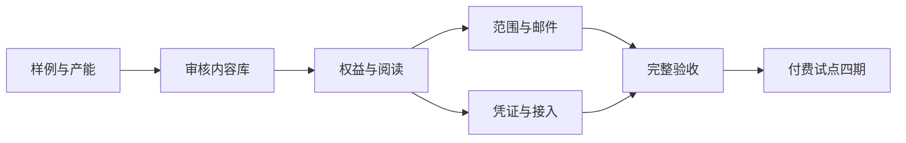

# 实施阶段与放行标准

版本：0.0.1｜状态：待评审｜日期：2026-10-03。此处只规划，不授权开发、收款、发信或生产发布。

实施顺序：先做出专业交付物并验证产能，再建立内容权限和分发，最后进行收费试点。阶段按完成判据推进，未评估工作量前不承诺上线日期。

## 阶段0：样例与交付验证

输入：现有记录/价格/证据及已确认内容定位。

交付：建议3篇重要变化详解、2份专题、1期完整简报；每篇完成来源、条件、模型归属、时间和结论检查；记录实际制作/复核工时。真实事件不足时减量并解释。

放行：确认首批支持厂商/主题、编辑与审核承担者、每周出版时间；目标用户能说清用途，至少5位愿意体验后续两期。没有付费意愿也保留反馈，不能把兴趣登记算成交。产能不成立时收窄交付范围或延后收费。

## 阶段1：内容结构与审核出版

依赖阶段0中的内容结构。先形成技术任务书，确定内容ID/版本、引用关系、范围标签、发布时间与覆盖状态，明确公开预览/专业全文的分离。

交付：统一专业内容库、草稿/审核/出版/更正/撤回操作、固定周期及稳定引用、可复用专题；运营可复核候选与发布结果。首版可用受控CLI或文件流程，不强求建设大型CMS；所有路径都执行发布校验和留痕。

放行：未审核草稿不能发布，重复执行不覆盖版本；正文/表格/摘要一致；零变化、覆盖失败、旧证据撤回有正确结果。

## 阶段2：账户权益与受保护阅读

依赖内容与预览边界。复用现有账户，新增服务期与人工管理记录，明确到期/撤销规则。开发前定服务端权限合同及加法迁移/备份恢复方案。

交付：专业栏目、真实样例、申请入口、权益管理、受保护阅读与Markdown/CSV导出。正文通过授权服务获取，不打进匿名静态产物或公开数据；公共接口保持原合同。

放行：有效用户可读；免费、到期、撤销与跨用户请求无法取得专业全文；静态构建、公共缓存、匿名REST/MCP/RSS不漏正文。现有免费功能回归通过。

## 阶段3：范围配置、个人简报与邮件

依赖统一内容与权益。

交付：厂商/模型/系列/主题选择、匹配预览、关注导入、独立专业邮件开关、范围快照、按周期组合、投递去重/重试/更正及状态展示。复用已上线邮件适配和运维，专业任务身份独立，不能复用免费每日任务而混淆退订。

放行：对象并集/主题交集正确，未归属模型不误选；改范围不重写历史；到期发送前重新查权益；无变化与信源失败区分；退订不影响免费邮件；重跑和更正不重复发送。

## 阶段4：Token、MCP/Agent与私有RSS

依赖受保护查询及权益规则。先做客户端兼容探针，再确定新增协议。原五个公共MCP工具、匿名REST与公共RSS保持兼容。

交付：命名/到期/撤销/最近使用的凭证管理；专业目录、简报、详解、专题的查询能力；Skill配置与失败恢复说明；独立私有RSS地址及轮换。

放行：同账号跨渠道版本一致；通用Token不出现在URL/日志/提示词，RSS凭证范围受限；撤销/到期生效；至少两类Agent客户端和一个真实RSS阅读器通过，不只检查配置文件。

## 阶段5：完整验收与收费试点

依赖所有P0场景。交付：用户故事验收记录、完整样例、服务说明、明确试点报价/有效期/延期及退款处理、转化漏斗与编辑工时记录。上线前制作具体候选、版本清单、回归结果及回滚方案，遵守既有发布授权边界。

放行：先完成本地和隔离投递验收，再核对生产受保护读取、实际收信、私有订阅与撤销；生产发信使用经明确授权的试点收件人。不能把本地outbox或邮件服务接受请求当实际收信。

首轮至少4个出版周期；按真实付费/继续付费、工作用途、质量和制作成本决定是否继续，不先增加套餐或自动扣款。

## 后续范围

P1根据试点增加专题类型、候选去重和编辑效率。团队协作、自动支付、更多范围配置、实时监控及模型调用另立计划，不混进首版验收。

## 阶段依赖

## 开发前需要定的技术细节

产品计划不冻结实现字段或接口名字。各阶段技术任务书须补充：内容持久化与发布事务；专业正文服务与静态站衔接；统一权益判断；Token范围/轮换与RSS地址保护；个人简报引用和更正传播；投递身份及幂等窗口；协议兼容、缓存、日志脱敏与限流；备份和迁移回滚。

这些技术细节不得改变免费/专业内容边界、独立退订、证据规则和用户故事结果。
